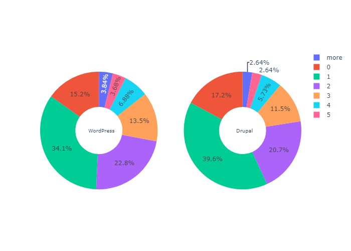
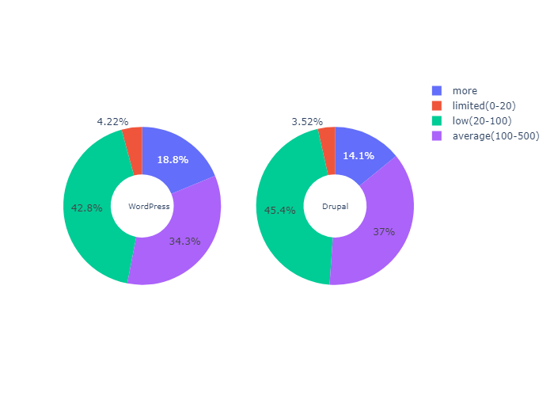
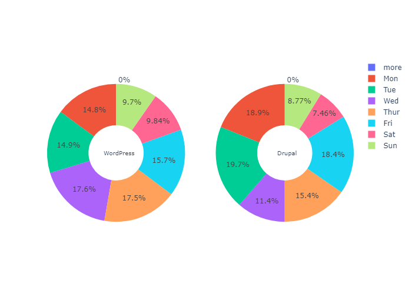
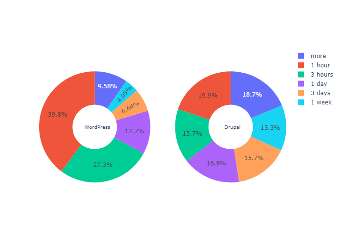
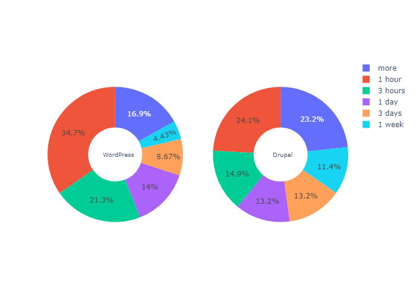
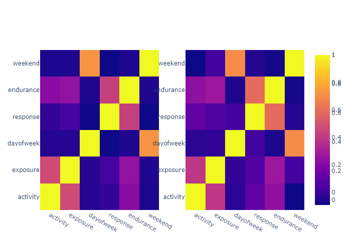

# Initial Analysis on Stack Overflow Posts: Tag Difference

## 1. Introduction

Stack Overflow is a question-and-answer website for professional and enthusiast programmers. It features questions and answers on a wide range of topics in computer programming. The website serves as a platform for users to ask and answer questions and, through membership and active participation, to vote questions and answers up or down.

Based on the interest of understanding the behaviour of contributors on Stack Overflow(SO), an initial study is conducted. Specifically, this project investigates the distribution difference between two tags(*WordPress* and *Drupal*) within a given period (2020.01.01-2020.06.30) on SO.

## 2. Data Prepare

### A. Data Extraction

Scrapy is applied to extract structured data from the websites. Each item includes the question id, question vote counts, question view counts, question post timestamp, question active timestamp, answer counts, answer vote sum and timestamp of the first answer.

The crawler iterates through all the questions in the scope with *pages* parameters. Finally, there are 6179 rows in [*WordPress*](./data/wordpress_raw.csv) and 243 rows in [*Drupal*](./data/drupal_raw.csv).

### B. Feature Engineering

**Step 1. Clean Data**

- Transfer data type(e.g. to numeric/timestamp)
- Drop data out of the scope
- Remove abnormal values

**Step 2. Metrics**

Table 1: Metrics Clarification

|               |                Definition                |                          Motivation                          |
| :-----------: | :--------------------------------------: | :----------------------------------------------------------: |
| **activity**  |    qvotes + answers + answer vote sum    |                Presents the heat of the post                 |
| **exposure**  |                  views                   |              Presents the exposure of the post               |
| **dayofweek** |      day of week from ask timestamp      | Due to the uniform timezone of the timestamps, hour of day is useless, thus selecting day of week |
| **response**  | seconds between ask and the first answer | Presents the extent to which questions are resolved in a timely manner |
| **endurance** | seconds between ask and the active time  | Presents the extent to which posts receive sustained attention |

## 3. Plots of Distribution

### A. Descriptive Statistics

Table 2: Descriptive Statistics of WordPress

|       | activity | exposure |  response   |  endurance  |
| :---: | :------: | :------: | :---------: | :---------: |
| count |   6075   |   6075   |    4594     |    6075     |
| mean  | 2.16247  | 380.268  | 1.11131e+06 | 3.27548e+06 |
|  std  | 3.70932  | 1142.33  | 5.04794e+06 | 1.01582e+07 |
|  min  |    0     |    8     |      0      |      0      |
|  25%  |    1     |    43    |   1541.5    |    1504     |
|  50%  |    2     |   114    |    6261     |    12294    |
|  75%  |    3     |   371    |   53691.5   |   154420    |
|  max  |   214    |  49000   | 6.29331e+07 | 6.61956e+07 |

Table 3: Descriptive Statistics of Drupal

|       | activity | exposure |  response   |  endurance  |
| :---- | :------: | :------: | :---------: | :---------: |
| count |   228    |   228    |     166     |     228     |
| mean  |   1.75   | 256.127  | 1.44988e+06 | 2.89139e+06 |
| std   | 1.66163  | 343.712  | 5.78398e+06 | 8.54109e+06 |
| min   |    0     |    13    |     192     |      0      |
| 25%   |    1     |    53    |   6120.75   |   4249.5    |
| 50%   |    1     |   110    |    74213    |   73319.5   |
| 75%   |    2     |  347.5   |   408222    |   514281    |
| max   |    12    |   2000   | 5.27728e+07 | 5.48593e+07 |

From the tables above, it is clear that, on average, WordPress questions are more active, responded more quickly, received more attention, and endured longer. Besides, the answer rate of WordPress(75.6%) is also slightly higher than Drupal's(72.8%).

### B. Pie Charts

Due to the significant extreme differences in the data, pie charts are drawn to present the distribution based on the statistics above.

Figure 1: Value Counts of Activity

The distribution of activity in the two topics is very similar. Most posts received only one act, and inactive posts(activity<=3) account for nearly 92% of the whole.

Figure 2: Value Counts of Exposure

The distribution of activity in the two topics is very similar. Nearly half of posts were viewed at relatively low times. However, it is surprising that very few posts(about 4%) are completely buried.

Figure 3: Value Counts of Dayofweek

Questions posted on weekends are relatively fewer for both tags. Questions tagged *WordPress* posted slightly extensive on days far from weekends, i.e., Wednesday and Thursday, while the opposite applies to *Drupal*.

Figure 4: Value Counts of Response

Compared to similar response rates, the performance of questions in the two topics differed significantly in terms of timely response. 2/3 of *WordPress* questions were answered within 3 hours, and the rate mounts to nearly 80% after one day, while roughly half of the *Drupal* questions did not receive any answer in one day, and 18.7% of answers took too long(more than one week).

Figure 5: Value Counts of Endurance

*WordPress* questions tend to be active for a shorter period since their proportions of short endurance(1 hour, 3 hours and 1 day) are all lower than *Drupal*'s. A plausible explanation is that *WordPress* questions are effectively responded to in time, obviating the need for further activity.

## 4. Analysis of Difference

### A. Correlation Analysis

> In statistics, correlation or dependence is any statistical relationship, whether causal or not, between two random variables or bivariate data. In the broadest sense correlation is any statistical association, though it actually refers to the degree to which a pair of variables are linearly related.

No doubt, there must be correlations among the five metrics. The idea of correlation analysis is to figure out how these correlations vary between the two tags and therefore present a distinct difference between them.

To begin with, the correlation matrix is required, based on which the metric pairs are selected. The Spearman method is applied here since the variables do not follow a normal distribution.

Figure 6: Correlation Matrix Heatmap

Their heatmaps seem similar. Among the metric pairs, two distinct pairs are selected: (exposure, activity) and (response, endurance).

Figure 7: Exposure-Activity Scatter

.png)

As exposure amounts, the activity of both tags shows no inclination to grow, most of which are constrained under a certain level. Still, for *WordPress*, the maximum of activity increases. It indicates that large-scale data are more likely to show this correlation.

Figure 8: Endurance-Response Scatter

.png)

The number of posts declines drastically when response or endurance goes up. After a certain period from their first answer, a few posts kept active. (Move the curve to the right until no sample is on its right side, *a certain distance* is the distance moved). Still, the period of *WordPress* is much longer.

### B. Significance Test

A test of significance is a formal procedure for comparing observed data with a claim (also called a hypothesis), the truth of which is being assessed. Since the data distribution does not follow the normality assumption, the method of Kruskal-Wallis test is selected.

> The Kruskal–Wallis test is a non-parametric method for testing whether samples originate from the same distribution. It is used for comparing two or more independent samples of equal or different sample sizes.

**Step 1. State the hypotheses**

The null hypothesis (H0): The median is equal across all groups.

The alternative hypothesis: (Ha): The median is *not* equal across all groups.

**Step 2. Perform the Kruskal-Wallis Test**

Table 4: Kruskal Result for Each Metric

|               | statistics |  p-value  |
| :-----------: | :--------: | :-------: |
| **activity**  |   6.373    |   0.012   |
| **exposure**  |  3.667e-3  |   0.952   |
| **response**  |   58.12    | 2.470e-14 |
| **endurance** |   21.04    | 4.507e-6  |

**Step 3. Interpret the results**

In terms of activity, response and endurance, the p-values are less than 0.05; we can reject the null hypothesis. We have sufficient evidence to conclude that metrics of *WordPress* and *Drupal* follow a different distribution.

## 5. Threats to Validity

Although it is taken into account that the timestamp indication of hours does not provide the actual working hours of contributors and day of week is extracted as a metric, the accuracy of this approach is still influenced by time zones. What's more, each record is not crawled from the web simultaneously, which means that the value updates during scrapy job are ignored.

Another threat to the validity of the analysis is the large disparity in data size. In the given study range, *WordPress* has 6179 posts, almost 26 times as many as *Drupal*(243). Any differences between them may be attributed to this, rather than to their essence.
